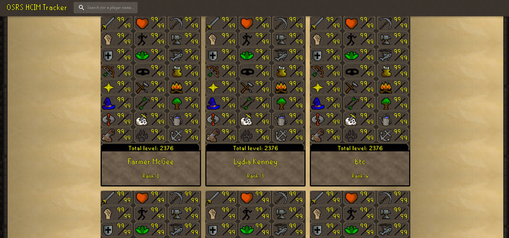
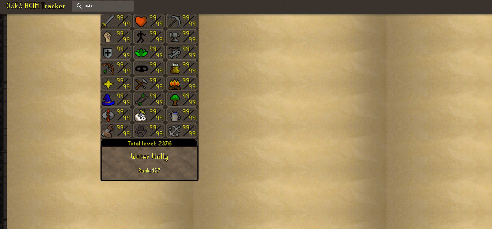
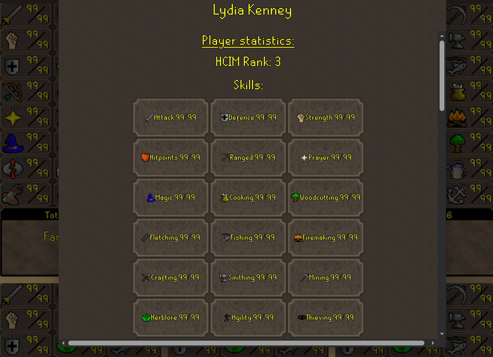
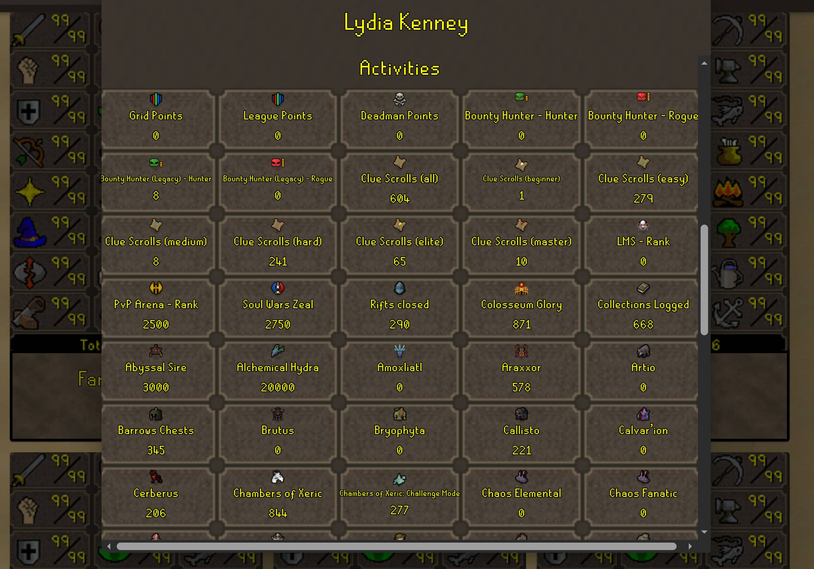
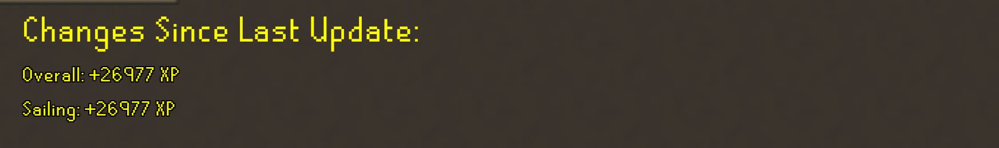

# OSRS Hardcore Ironman Tracker

A full-stack web application for tracking **Old School RuneScape Hardcore Ironman (HCIM)** players, their Hiscores statistics, and changes between updates.

The application retrieves Hardcore Ironman players from the official OSRS Hiscores, stores their statistics in PostgreSQL, and provides a React-based interface for browsing and updating player data.

## Features

* Browse Hardcore Ironman players in a responsive card-based interface
* Search for players by name
* View detailed player statistics
* Display:
  * Overall level and XP
  * Individual skill levels and XP
  * Boss and activity kill counts/scores
  * HCIM rank
* Update an individual player's Hiscores
* Compare a player's current statistics against their previously stored values
* Display XP gained and activity score increases since the previous update
* PostgreSQL database for persistent player and Hiscores data
* Dockerized frontend, backend, and database
* Automated backend and frontend tests
* Docker Compose configuration that prevents the application from starting if its test suite fails

---

# Application Walkthrough

## 1. Browse Players

The home page displays Hardcore Ironman players as cards.



Each card contains the player's name and current Hardcore Ironman rank.

Players can be filtered using the search bar in the navigation bar.

## 2. Search for a Player



Enter part or all of a player's name into the search bar.

The player list is filtered as the search query changes.

For example:

```text
Search: water
```

will display players whose names contain `water`.

## 3. View Player Statistics

Clicking a player card retrieves the player's latest Hiscores data and opens a detailed dialog.

The dialog displays:

* Player name
* HCIM rank
* Overall level
* Individual skill levels
* Boss/activity scores
* Changes detected since the previous database update





## 4. Update a Player

When a player card is clicked, the application requests the player's latest Hiscores data from the backend.

The backend:

1. Retrieves the player's current Hiscores.
2. Retrieves the player's previously stored statistics.
3. Compares the old and new values.
4. Records any increases.
5. Updates the database with the latest values.
6. Returns the updated player data and detected changes.

For example, if a player previously had:

```text
Fishing: 77
```

and their latest Hiscores show:

```text
Fishing: 78
```

the application can display the XP gained since the previous update.

The same process is used for activity and boss scores.

---

# Architecture

The application follows a three-tier architecture:

```text
┌──────────────────────────────┐
│          Browser             │
│                              │
│     React + TypeScript       │
└──────────────┬───────────────┘
               │ HTTP
               ▼
┌──────────────────────────────┐
│          Backend             │
│                              │
│       Flask + Python         │
│                              │
│  OSRS API / Hiscores access  │
│  Business logic              │
│  Database queries            │
└──────────────┬───────────────┘
               │ SQL
               ▼
┌──────────────────────────────┐
│         PostgreSQL           │
│                              │
│  Players                     │
│  Player skills               │
│  Player activities            │
└──────────────────────────────┘
```

The application is containerized using Docker.

```text
Docker Compose
│
├── frontend
│   └── React/Vite build → Nginx
│
├── backend
│   └── Flask/Python
│
├── PostgreSQL
│   └── Persistent database
│
├── backend-tests
│   └── Pytest
│
└── frontend-tests
    └── Vitest
```

The frontend does not communicate directly with the OSRS Hiscores endpoints.

Instead, requests are handled by the Flask backend.

This keeps external API communication and database access on the server side and allows the backend to handle data processing before returning results to the frontend.

---

# Technology Stack

## Frontend

* React
* TypeScript
* Vite
* Material UI (MUI)
* React Router
* Vitest
* React Testing Library
* jsdom

## Backend

* Python
* Flask
* Flask-CORS
* psycopg
* Requests
* BeautifulSoup
* python-dotenv
* Pytest
* pytest-cov

## Database

* PostgreSQL

## Infrastructure

* Docker
* Docker Compose
* Nginx

---

# Database

The application uses PostgreSQL to persist player information and Hiscores data.

The database is separated into related tables rather than storing all player information in a single table.

The primary relationships are:

```text
players
   │
   ├────────────── player_skills
   │
   └────────────── player_activities
```

A player can therefore have many skill records and many activity records.

## Player Data

The `players` table stores information such as:

* Player ID
* Player name
* Hardcore Ironman rank

## Skills

The `player_skills` table stores:

* Player ID
* Skill ID
* Rank
* Level
* Experience

A unique constraint on the player and skill IDs prevents duplicate skill records.

## Activities

The `player_activities` table stores:

* Player ID
* Activity ID
* Rank
* Score

A unique constraint on the player and activity IDs prevents duplicate activity records.

---

# OSRS Hiscores Integration

The application uses the official Old School RuneScape Hiscores endpoints to retrieve player data.

Two types of data retrieval are used.

## Hardcore Ironman Rankings

Because there is no official way to paginate through all of the hardcore ironman accounts, The backend uses beautifulsoup to scrape the official OSRS Hiscores ranking pages for Hardcore Ironman players, and extracts the following information:

* Player name
* HCIM rank

Because Jagex imposes rate limits on browsing their hiscores pages, it is recommended to build the database using the --small argument in order to scrape the first 20 pages for testing purposes. The time required to load more than the first few dozen pages of players becomes significant, and the risk of being rate limited increases.

## Individual Player Hiscores

Individual player statistics are retrieved from the OSRS Hiscores endpoint once we have access to the list of hardcore names.

The returned data includes skill and activity information such as:

```text
Skill
├── Rank
├── Level
└── XP

Activity
├── Rank
└── Score
```

The backend converts this information into the application's database structure.

---

# Change Detection

One of the main features of the application is detecting changes between Hiscores updates.

When a player is updated, their previous database values are compared with their latest Hiscores.

For skills, XP is compared:

```text
new XP > previous XP
```

If XP has increased, the application records:

* Skill name
* XP gained
* Previous level
* New level

For activities, the score is compared:

```text
new score > previous score
```

If the score has increased, the application records:

* Activity name
* Score gained

This allows the application to show what changed since the player's previous update instead of simply displaying their current statistics.

---

# API Endpoints

## `GET /api/players`

Returns the players currently stored in the database, including their associated skills and activities.

Example:

```text
GET /api/players
```

## `POST /api/players/<player_name>/update`

Retrieves the latest Hiscores for a specific player, updates the database, calculates changes, and returns the updated player.

Example:

```text
POST /api/players/ExamplePlayer/update
```

## `POST /api/update`

Updates the stored Hardcore Ironman ranks.

Example:

```text
POST /api/update
```

---

## Running the Application with Docker

Docker is the recommended way to run the complete application.

### Prerequisites

Install:

* Docker Desktop
* Git

Make sure Docker Desktop is running before starting the application.

### 1. Clone the Repository

```bash
git clone https://github.com/salan7/osrs-hcim-tracker.git

cd osrs-hcim-tracker
```

### 2. Create the Environment File

Create a `.env` file in the project root.

Example:

```env
DB_NAME=hcim
DB_USER=postgres
DB_PASSWORD=your_password
DB_HOST=postgres
DB_PORT=5432
```

The `.env` file contains local configuration and should **not** be committed to GitHub.

### 3. Build and Start the Application

From the project root:

```bash
docker compose up --build
```

Docker Compose will:

1. Build the backend image.
2. Build the frontend image.
3. Start PostgreSQL.
4. Initialize the database schema from `schema.sql`.
5. Run the backend test suite.
6. Run the frontend test suite.
7. Start the backend after its tests pass.
8. Start the frontend after its tests pass.

If a test suite fails, the corresponding application service will not start.

### 4. Populate the Database

The Docker setup creates the database and its tables, but **does not automatically download HCIM data**.

This is intentional because populating the database requires making a large number of requests to the OSRS Hiscores.

With the application still running, open a **second terminal** in the project directory.

For a small test dataset containing the first 20 pages:

```bash
docker compose exec backend python setup_database.py --small
```

For the first 100 pages (this will take much longer due to rate limits, over an hour):

```bash
docker compose exec backend python setup_database.py --big
```

For the complete HCIM Hiscores (all pages, will take **over a day** due to rate limits):

```bash
docker compose exec backend python setup_database.py
```

The setup script will:

1. Retrieve Hardcore Ironman players from the OSRS Hiscores.
2. Add the players to the PostgreSQL database.
3. Retrieve each player's Hiscores.
4. Store their skills and activities in the database.

The full scan can take a significant amount of time because requests are intentionally rate-limited.

### 5. Open the Application

Once the containers have started, open:

```text
http://localhost:5173
```

The Flask backend is available at:

```text
http://localhost:5000
```

After the database has been populated, the players and their Hiscores will appear in the application.

### Subsequent Runs

Once the database has been populated, you do **not** need to run `setup_database.py` every time the application starts.

Simply run:

```bash
docker compose up
```

The PostgreSQL data is stored in a Docker volume and persists between container restarts.

The `setup_database.py` script is primarily used for the initial database population.

Individual player Hiscores can subsequently be updated through the application.


---

# Running Tests

The project has automated tests for both the frontend and backend.

## Backend

From the `backend` directory:

```bash
python -m pytest
```

To run with coverage:

```bash
python -m pytest --cov=app
```

The backend test suite currently contains **40 tests** with approximately **99% code coverage**.

## Frontend

From the `frontend` directory:

```bash
npm test -- --run
```

The frontend test suite currently contains **39 tests** across 7 test files.

The frontend test suite currently achieves:

```text
100% Statements
100% Branches
100% Functions
100% Lines
```

## Docker Test Gating

The Docker Compose configuration also runs the tests automatically when the application is started:

```bash
docker compose up --build
```

The intended startup flow is:

```text
Run tests
   │
   ├── Tests pass ──→ Start application
   │
   └── Tests fail ──→ Application does not start
```

This provides a basic safeguard against starting the application with a failing test suite.

---

# Development

The application can also be developed without running the complete production-style Docker stack.

## Backend

Create/install the Python dependencies listed in:

```text
backend/requirements.txt
```

Then run:

```bash
python app.py
```

The backend runs on:

```text
http://localhost:5000
```

## Frontend

Install dependencies:

```bash
npm install
```

Then start the Vite development server:

```bash
npm run dev
```

The frontend will normally be available at:

```text
http://localhost:5173
```

---

# Testing Philosophy

Testing was used throughout development rather than only at the end of the project.

### Backend tests cover:

* Hiscores requests
* HCIM ranking retrieval
* Database interactions
* Player insertion
* Player retrieval
* Player updates
* Skill changes
* Activity changes
* API routes
* Error handling
* Retry behavior

External HTTP requests and database connections are mocked where appropriate so unit tests do not depend on the live OSRS service or a running production database.

### Frontend tests cover:

* Player cards
* Player dialogs
* Skill tiles
* Activity tiles
* Navigation/search
* Home page loading
* Player filtering
* Player updating
* Loading states
* Dialog interactions
* API service functions

This allows frontend behavior to be tested independently from the backend.

---

# License

This project is intended as a personal portfolio and learning project.

Old School RuneScape and RuneScape are trademarks of Jagex Ltd. This project is not affiliated with or endorsed by Jagex.
